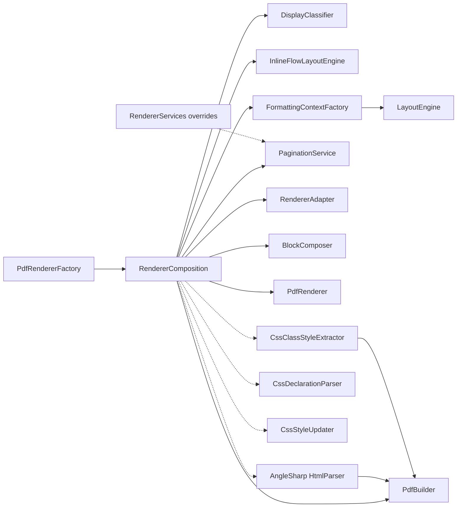

# Feature Specification: Centralized Composition and Transient Services

**Feature Branch**: `007-centralized-composition`  
**Created**: 2025-10-24  
**Status**: Draft  
**Input**: Push construction out of classes into a single composition point; make classes pure (no defaulting/service lookups); add internal factory to wire the pipeline; keep tests flexible via `RendererServices` overrides; update public entry points to wrap the composition root.

## Clarifications

### Session 2025-10-24

- Q: What is the service lifetime policy and scope boundary? → A: All classes transient; logging-only singletons allowed; scope starts at `PdfBuilder` and flows down the dependency graph.

## Composition Diagram



Notes:
- Scope starts at `PdfBuilder`; all nodes are transient unless explicitly provided as singletons (e.g., logging).
- `PdfRendererFactory` is a thin wrapper delegating to `RendererComposition`.
- Defaults are chosen only inside `RendererComposition`; constructors contain no defaulting or lookups.

### Test Overrides Example

```csharp
// Arrange
var fakePagination = new FakePaginationService();
var services = RendererServices.ForTests().With(pagination: fakePagination);
var options = new RendererOptions { EnablePagination = true };

// Act: composition root wires the full pipeline starting at PdfBuilder
var renderer = RendererComposition.CreateRenderer(options, services);
var pdfBytes = renderer.Render(new[] { documentNode }, header: null, footer: null);

// Assert: interactions route through the fake (illustrative)
fakePagination.AssertCalled();
```

## User Scenarios & Testing *(mandatory)*

### User Story 1 - Create pipeline via single composition root (Priority: P1)

As a maintainer, I can create a fully wired pipeline via `RendererComposition.CreateRenderer(options)` without any hidden defaults inside classes.

**Why this priority**: Establishes the centralized composition contract; unblocks all downstream refactors and tests.

**Independent Test**: Instantiate the renderer with only `RendererOptions` and render a simple HTML input to PDF; verify output is produced without service lookups or defaulting in constructors.

**Acceptance Scenarios**:

1. **Given** valid `RendererOptions`, **When** I call `RendererComposition.CreateRenderer(options)` and then `Render(html)`, **Then** a PDF is produced successfully.
2. **Given** no DI container, **When** I construct classes, **Then** no constructor performs default creation or service lookup.

---

### User Story 2 - Override a pipeline service in tests (Priority: P2)

As a tester, I can supply `RendererServices` with a fake `PaginationService` and verify the renderer uses it.

**Why this priority**: Ensures testability without DI frameworks; validates the override seam.

**Independent Test**: Use `RendererServices.ForTests().With(pagination: fake)` when creating the renderer; assert calls and behavior route through the fake.

**Acceptance Scenarios**:

1. **Given** a fake `PaginationService`, **When** I pass it via `RendererServices` to the factory, **Then** pagination calls hit the fake implementation only.

---

### User Story 3 - Public API remains unchanged (Priority: P3)

As a consumer, I can continue using `PdfBuilder` exactly as before, with no changes to my existing code.

**Why this priority**: Preserves public API compatibility; ensures no breaking changes for consumers.

**Independent Test**: Use `new PdfBuilder()` and verify it works exactly as before, with all existing functionality preserved.

**Acceptance Scenarios**:

1. **Given** existing consumer code, **When** I use `new PdfBuilder()`, **Then** all functionality works identically to before the refactor.

---

### Edge Cases

- Factory called with null or incomplete `RendererServices` overrides → defaults provided only by the composition root.
- Logging disabled scenario → default to a no-op logger without affecting behavior.

## Requirements *(mandatory)*

### Functional Requirements

- **FR-001**: Provide an internal composition root `RendererComposition.CreateRenderer(RendererOptions options, RendererServices? services = null)` that wires the full pipeline.
- **FR-002**: Constructors of core types accept only explicit dependencies; remove all "create defaults" logic and service lookups from classes. Centralize all defaults in the composition root; no other class may establish defaults.
- **FR-003**: All classes constructed by the composition root are stateless; exceptions limited to special cases like logging/tracing that may be singletons if provided via `RendererServices`.
- **FR-004**: Enable test-time overrides via `RendererServices` (e.g., `ForTests().With(pagination: fake)`), leveraging `InternalsVisibleTo` to access internal factory/services.
- **FR-005**: Update `PdfRendererFactory` to delegate to the composition root; keep it a thin wrapper with no internal default wiring.
- **FR-006**: Preserve all existing public constructors of `PdfBuilder`; refactor internal dependency creation to use composition root.
- **FR-007**: The composition root wires, at minimum: `DisplayClassifier`, `InlineFlowLayoutEngine`, `FormattingContextFactory` → `LayoutEngine`, `PaginationService`, `RendererAdapter`, `BlockComposer`, `PdfRenderer`.

### Key Entities *(include if feature involves data)*

- **RendererComposition**: Internal static factory responsible for constructing the renderer graph and owning defaults.
- **RendererServices**: Internal object for selective overrides of pipeline services (used primarily by tests).
- **RendererOptions**: Public options input driving composition decisions and defaults.
- **PdfBuilder**: Public API class that uses composition root internally for dependency creation.
- **Core components**: `DisplayClassifier`, `InlineFlowLayoutEngine`, `FormattingContextFactory`, `LayoutEngine`, `PaginationService`, `RendererAdapter`, `BlockComposer`, `PdfRenderer`.

## Success Criteria *(mandatory)*

### Measurable Outcomes

- **SC-001**: Zero constructors include optional/defaulting parameters or perform service lookups after refactor.
- **SC-002**: A test can replace `PaginationService` via `RendererServices` and all pagination interactions route through the fake.
- **SC-003**: Public factories delegate exclusively to the composition root (verified by unit test); `PdfBuilder` constructors contain no defaulting logic.
- **SC-004**: All existing `PdfBuilder` constructors work identically to before the refactor; no breaking changes to public API.

